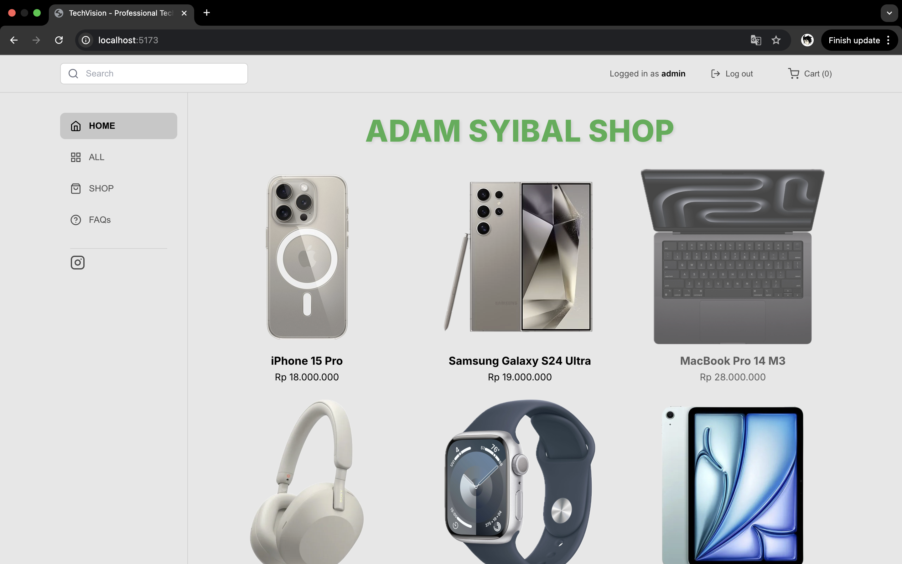
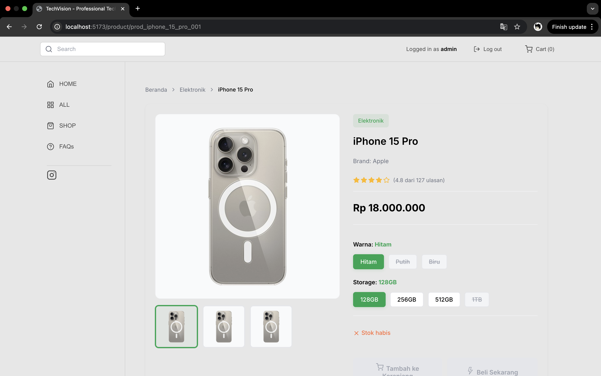

# Anjay E-commerce

E-commerce website dengan React + TypeScript (Frontend) dan Express.js + MongoDB (Backend).

## 📸 Screenshots

### Dashboard / Homepage


### Product Detail Page


## 🚀 Quick Start

### Backend Setup

1. Install dependencies:
```bash
cd backend
npm install
```

2. Seed database dengan data awal:
```bash
node seed.js
```

3. Jalankan backend server:
```bash
npm run dev
```
Server akan berjalan di `http://localhost:5000`

### Frontend Setup

1. Install dependencies:
```bash
cd anjay
npm install
```

2. Jalankan development server:
```bash
npm run dev
```
Frontend akan berjalan di `http://localhost:5173`

## 📁 Struktur Project

```
.
├── backend/              # Express.js API Server
│   ├── config/          # Database configuration
│   ├── routes/          # API routes
│   ├── server.js        # Main server file
│   ├── seed.js          # Database seeder
│   └── .env             # Environment variables
│
└── anjay/               # React Frontend
    ├── src/
    │   ├── components/  # React components
    │   ├── pages/       # Page components
    │   ├── services/    # API services
    │   ├── context/     # React context
    │   └── data/        # Static data
    └── public/
```

## 🔧 Tech Stack

### Frontend
- React 19
- TypeScript
- React Router
- Vite

### Backend
- Node.js
- Express.js
- MongoDB (Atlas)

## 📝 Features

- ✅ Product catalog dengan grid layout
- ✅ Shopping cart functionality
- ✅ Product detail pages
- ✅ Sidebar navigation
- ✅ Search functionality
- ✅ MongoDB integration
- ✅ RESTful API
- ✅ Responsive design

## 🌐 API Endpoints

- `GET /api/products` - Get all products
- `GET /api/products/:id` - Get single product
- `POST /api/products` - Create product
- `PUT /api/products/:id` - Update product
- `DELETE /api/products/:id` - Delete product

## 🎨 Design

Layout menggunakan:
- Sidebar kiri untuk navigasi
- Header dengan search bar dan cart
- Grid 3 kolom untuk product catalog
- Background abu-abu (#E8E8E8)

## 📦 Deployment

### Backend
Deploy ke Heroku, Railway, atau Render

### Frontend
Deploy ke Netlify atau Vercel
```bash
cd anjay
npm run build
# Upload folder dist/ ke hosting
```

## 🔐 Environment Variables

### Backend (.env)
```
MONGODB_URI=your_mongodb_connection_string
PORT=5000
DB_NAME=anjay_shop
```

### Frontend (.env)
```
VITE_API_URL=http://localhost:5000/api
```

## 👨‍💻 Development

Untuk development, jalankan backend dan frontend secara bersamaan di terminal yang berbeda.

Terminal 1 (Backend):
```bash
cd backend && npm run dev
```

Terminal 2 (Frontend):
```bash
cd anjay && npm run dev
```
